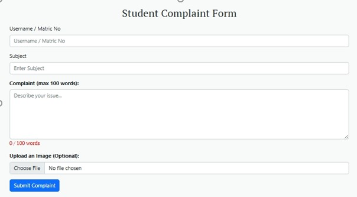

# 📩 Complaint Ticket System

## 🔍 Overview

The **Complaint Ticket System** is designed for lifetechocms framework, it is a user-friendly platform for handling complaints through a ticket-based workflow. Complainants can submit issues and receive a unique Ticket ID. Administrators can view, respond, and update complaint statuses. The admins can send notes with tag to each other on a ticket, both Admins and Complainants can exchange messages through a chat-style interface with full support for email notifications and ticket history tracking.

## 🔍 Framework Used
This project uses [Lifetech OCMS](https://github.com/lifetechOCMS/lifetechocms.git) as its framework.
---

## 👤 Complainant Features

### 1. Complaint Submission

Complainants (authenticated or anonymous) can submit a new complaint via a user-friendly form.

- **Form Fields**:
  - Username or Matric No (required for anonymous users)
  - Complaint Subject
  - Message Content
  - Optional File Attachment

- **Submission Process**:
  1. Form data is validated.
  2. A unique Ticket ID is generated.
  3. Complaint is saved to the database.
  4. Complainant receives an email with the Ticket ID.
  5. A confirmation message is displayed to the user.

---

### 2. Ticket Search & Reply

Complainants can retrieve and reply to previous complaints by searching with:

- **Username/Matric No**
- **Ticket ID**

They can:
- View ticket history
- Post additional replies or information

---

## 👨‍💼 Admin Features

### 1. Complaint Management Dashboard

Admins (support staff or moderators) can efficiently manage complaints:

- View all complaint tickets
- Filter by status (Pending, In Progress, Resolved)
- Reply to complaints
- Update ticket statuses
- Add internal notes (not visible to complainants)

> 💡 **Note**: Every admin reply triggers an email notification to the complainant.

---

### 2. Search Complainant History

Admins can quickly search all tickets submitted by a specific user using their **Username or Matric No**.

---

## 💬 Reply Mechanism (Chat-style View)

Replies are saved in the `tb_complaint_feedback` table and displayed in a clean chat-like interface.

- **Complainant messages**: Aligned right
- **Admin messages**: Aligned left
- **Each message includes**:
  - Timestamp
  - Sender role
  - Optional support note

---

## 📧 Email Notifications

The system supports automatic email notifications for key events:

| Event                      | Recipient       | Description                            |
|---------------------------|-----------------|----------------------------------------|
| Complaint Created         | Complainant     | Ticket ID confirmation                 |
| Admin Reply               | Complainant     | Message reply notification             |
| Status Update             | Complainant     | Notification for complaint status      |

---

## 📁 Database Structure

- `tb_complaints`: Stores complaint tickets
- `tb_complaint_feedback`: Stores all replies and status updates

---

## 🚀 Getting Started

To run the project locally or on a server, follow the standard installation steps for your platform.

1. Clone the repository
2. Import the SQL structure
3. Configure email credentials
4. Deploy on a supported server environment

---

## 🛠 Technologies Used

- PHP (LifetechOCMS Framework)
- MySQL
- JavaScript
- HTML/CSS
- Email SMTP/PHPMailer

---

## 🤝 Contributions

Feel free to fork the repository and contribute. All improvements and suggestions are welcome!

---
## 🤝 Supervision

This module was supervised by  [Adetunji Adedayo](https://github.com/Thenewteejay)  

---
## 📄 License

This project is open-source and free to use for educational or organizational purposes.